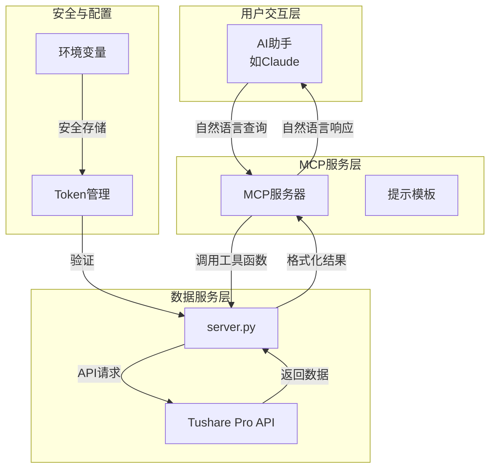

# Smart Financial MCP

基于 Model Context Protocol (MCP) 的智能股票数据助手，提供与 AI 助手自然对话获取股票数据的能力。


## 🎯 项目概述

Smart Financial MCP 是一个基于 Model Context Protocol 的金融数据 MCP 服务器，连接 Tushare Pro API，为投资研究、财务分析、行业分析从业者及 AI 助手用户提供便捷的股票数据查询能力。

### 核心特性

- 🤖 **AI 助手集成**：与 Claude 等 AI 助手无缝对话
- 📊 **实时数据**：连接 Tushare Pro API 获取实时金融数据
- 🔒 **安全管理**：本地加密存储 Tushare API Token
- 📈 **多种数据**：支持股票、ETF、指数、期货等多种金融产品
- 🎨 **智能分析**：自动生成财务分析报告和可视化表格

### 技术架构



## 🚀 快速开始

### 环境要求

- Python 3.10 或更高版本
- Tushare Pro 账号和 API Token

### 安装步骤

1. **从 PyPI 安装**
```bash
pip install smart-finacial-mcp
```

2. **从源码安装**
```bash
git clone https://github.com/YUHAI0/smart-finacial-mcp.git
cd smart-finacial-mcp
pip install -e .
```

### 配置 Tushare Token

首次使用需要配置 Tushare Pro API Token：

1. 注册 [Tushare Pro](https://tushare.pro) 账号
2. 获取 API Token
3. 使用 AI 助手的 `setup_tushare_token` 工具进行配置

## 🔧 在 MCP 服务器中添加

```json
{
  "mcpServers": {
    "smart-financial-mcp": {
      "command": "uvx",
      "args": ["smart-finacial-mcp"],
      "env": {
        "TUSHARE_TOKEN": "your-tushare-token"
      }
    }
  }
}
```

## 📚 MCP 工具完整指南

### 1. Token 管理工具

#### `check_token_status`
**功能**：检查 Tushare token 配置状态
**参数**：无
**返回**：Token 状态信息

```
示例：检查当前 Token 是否配置正确
```

### 2. 股票基础信息工具

#### `get_stock_basic_info`
**功能**：获取股票基础信息
**参数**：
- `ts_code`（可选）：股票代码（如：000001.SZ）
- `name`（可选）：股票名称（如：平安银行）

**返回数据**：
- 股票代码、名称
- 所属地区、行业
- 上市日期、市场类型
- 交易所、币种等

```
示例：
- 按代码查询：get_stock_basic_info(ts_code="000001.SZ")
- 按名称查询：get_stock_basic_info(name="平安银行")
```

#### `search_stocks`
**功能**：智能搜索股票
**参数**：
- `keyword`（必填）：搜索关键词

**特性**：
- 支持模糊匹配
- 同时搜索代码和名称
- 不区分大小写

```
示例：
- 搜索平安相关：search_stocks(keyword="平安")
- 搜索代码：search_stocks(keyword="600")
```

### 3. 行情数据工具

#### `get_daily_stock_price`
**功能**：获取 A 股日线行情数据
**参数**：
- `ts_code`（可选）：股票代码，支持多股票（逗号分隔）
- `trade_date`（可选）：交易日期（YYYYMMDD）
- `start_date`（可选）：开始日期（YYYYMMDD）
- `end_date`（可选）：结束日期（YYYYMMDD）

**返回数据**：
- 开盘价、最高价、最低价、收盘价
- 涨跌额、涨跌幅
- 成交量、成交额
- 统计分析（期间涨跌幅、波动率等）

#### `get_realtime_stock_price`
**功能**：获取实时行情数据
**参数**：
- `ts_code`（必填）：股票代码，支持通配符（如：6*.SH）

**特性**：
- 支持单股票详细查询
- 支持批量查询
- 支持通配符匹配
- 实时涨跌统计

#### `get_etf_daily_price`
**功能**：获取 ETF 日线行情
**参数**：
- `ts_code`（可选）：基金代码
- `trade_date`（可选）：交易日期
- `start_date`（可选）：开始日期
- `end_date`（可选）：结束日期

#### `get_index_daily_price`
**功能**：获取指数日线行情
**参数**：
- `ts_code`（必填）：指数代码（如：399300.SZ 沪深300）
- `trade_date`（可选）：交易日期
- `start_date`（可选）：开始日期
- `end_date`（可选）：结束日期

**支持指数**：
- 399300.SZ：沪深300
- 000001.SH：上证指数
- 399001.SZ：深证成指
- 399006.SZ：创业板指
- 000905.SH：中证500

#### `get_futures_daily_price`
**功能**：获取期货日线行情
**参数**：
- `trade_date`（可选）：交易日期
- `ts_code`（可选）：合约代码
- `exchange`（可选）：交易所代码
- `start_date`（可选）：开始日期
- `end_date`（可选）：结束日期

**支持交易所**：
- SHF：上海期货交易所
- DCE：大连商品交易所
- CZE：郑州商品交易所
- INE：上海国际能源交易中心

### 4. 基本面分析工具

#### `get_daily_basic_indicators`
**功能**：获取每日基本面指标
**参数**：
- `ts_code`（可选）：股票代码
- `trade_date`（可选）：交易日期
- `start_date`（可选）：开始日期
- `end_date`（可选）：结束日期

**返回指标**：
- 估值指标：PE、PB、PS、股息率
- 交易指标：换手率、量比
- 股本数据：总股本、流通股本
- 市值数据：总市值、流通市值

#### `get_income_statement`
**功能**：获取利润表数据并生成智能分析
**参数**：
- `ts_code`（必填）：股票代码
- `start_date`（可选）：开始日期
- `end_date`（可选）：结束日期
- `report_type`（可选）：报告类型（默认：1-合并报表）

**智能分析包含**：
- 📊 财务数据表格化展示
- 🔍 收入分析（同比、环比增长）
- 💰 盈利能力分析（毛利率、净利率等）
- 📈 成本费用分析
- ⚡ 每股指标分析

### 5. 市场数据工具

#### `get_stock_limit_prices`
**功能**：获取涨跌停价格数据
**参数**：
- `ts_code`（可选）：股票代码
- `trade_date`（可选）：交易日期
- `start_date`（可选）：开始日期
- `end_date`（可选）：结束日期

**特性**：
- 全市场涨跌停统计
- 价格区间分析
- 价格段分布统计

#### `get_financial_news`
**功能**：获取财经快讯新闻
**参数**：
- `src`（必填）：新闻来源
- `start_date`（必填）：开始时间（格式：2024-08-01 09:00:00）
- `end_date`（必填）：结束时间

**支持新闻源**：
- sina：新浪财经
- wallstreetcn：华尔街见闻
- 10jqka：同花顺
- eastmoney：东方财富
- cls：财联社
- yicai：第一财经

**智能分析**：
- 📰 新闻列表展示
- ⏰ 时间分布统计
- 🔥 热门关键词提取

### 6. 提示模板

#### `income_statement_query`
**功能**：利润表查询引导模板
**用途**：为用户提供利润表查询的详细指导

## 💡 使用示例

### 基础查询
```
"查询平安银行的基本信息"
"搜索包含新能源的股票"
"获取贵州茅台最近一个月的股价"
```

### 深度分析
```
"分析平安银行2023年的利润表"
"查询沪深300指数最近一周的走势"
"获取今日涨停股票统计"
```

### 市场监控
```
"获取今日财联社快讯"
"查询创业板ETF的实时行情"
"分析中证500的每日基本面指标"
```

## 🔒 数据安全

- **本地存储**：Token 存储在本地 `~/.tushare_mcp/.env` 文件
- **加密传输**：所有 API 调用使用 HTTPS 加密
- **权限控制**：基于 Tushare Pro 积分制度的访问控制

## 🤝 贡献指南

1. Fork 本仓库
2. 创建特性分支：`git checkout -b feature/AmazingFeature`
3. 提交更改：`git commit -m 'Add some AmazingFeature'`
4. 推送到分支：`git push origin feature/AmazingFeature`
5. 开启 Pull Request

### 开发环境

```bash
# 克隆仓库
git clone https://github.com/YUHAI0/smart-finacial-mcp.git
cd smart-finacial-mcp

# 安装开发依赖
pip install -e ".[dev]"

# 运行代码质量检查
black smart_finacial_mcp/
isort smart_finacial_mcp/
flake8 smart_finacial_mcp/
mypy smart_finacial_mcp/
```

## 📄 开源协议

本项目采用 MIT 协议开源 - 查看 [LICENSE](LICENSE) 文件了解详情。

## 🙏 致谢

- [Tushare Pro](https://tushare.pro) - 提供专业的金融数据 API
- [Model Context Protocol](https://github.com/modelcontextprotocol) - 提供 AI 助手集成框架
- [FastMCP](https://github.com/modelcontextprotocol/servers) - 提供高效的 MCP 服务器实现

## 📞 联系方式

- **作者**：yuhai
- **邮箱**：me.yuhai@hotmail.com
- **项目地址**：https://github.com/YUHAI0/smart-finacial-mcp
- **问题反馈**：https://github.com/YUHAI0/smart-finacial-mcp/issues

---

⭐ 如果这个项目对你有帮助，请给它一个星标！

🚀 开始使用 Smart Financial MCP，让 AI 助手成为你的专业金融数据分析师！